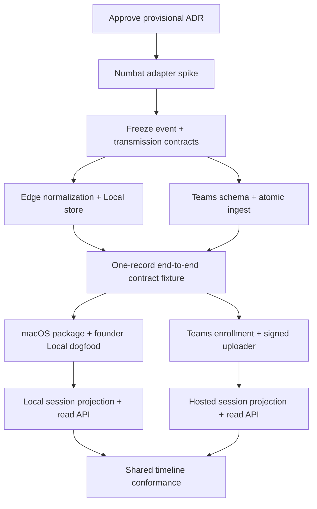

# Belay Implementation Plan: M0–M2

- **Status:** Approved; implementation active
- **Date:** 2026-09-08
- **Product source:** Belay BRD v2.2
- **Architecture source:** Belay HLD v1.1
- **Current repository:** `DoplexLabs/belay-engine`

## 1. Overview

This plan takes Belay from an empty repository through:

- **M0:** validated Numbat boundary, canonical contracts, Local persistence,
  and atomic Teams ingest
- **M1:** founder-machine Local dogfood and optional Teams streaming
- **M2:** semantically identical Local and hosted session timelines

The implementation begins with contracts because the public edge and private
cloud must evolve independently without drifting. No landing-page work is part
of this plan.

## 2. Provisional technology decisions

ADR 0001 proposes:

- Public `belay-engine` and private `belay-cloud` repositories
- Go for the edge and Local services
- TypeScript for Teams API, workers, and browser UI
- SQLite for Local and Postgres for Teams
- JSON Schema/OpenAPI as contract sources
- Postgres-backed hosted jobs

These choices were approved on 2026-09-08. Cloud-provider selection is
intentionally deferred and must not change the public contracts.

## 3. Cross-service contracts

| Contract | Producer | Consumers | Source |
|---|---|---|---|
| Canonical event envelope | Shared contracts | Edge, Local projections, Teams ingest/projections | [`event-envelope-v1.md`](../contracts/event-envelope-v1.md) |
| Teams transmitted fields | Edge policy | Enrollment UI, uploader, ingest validator | [`transmitted-fields-v1.md`](../contracts/transmitted-fields-v1.md) |
| Local/Teams state | Edge enrollment | Local UI, uploader, Teams control plane | [`local-teams-state-v1.md`](../contracts/local-teams-state-v1.md) |
| Teams ingest | Cloud ingest | Edge uploader | [`teams-ingest-v1.md`](../contracts/teams-ingest-v1.md) |
| Shared read API | Local/hosted read adapters | Local/Teams UI, MCP, integrations | [`read-api-v1.md`](../contracts/read-api-v1.md) |
| Read-only MCP | Local/hosted MCP adapters | Customer agents | [`mcp-v1.md`](../contracts/mcp-v1.md) |
| Numbat mapping | Numbat adapter | Canonical normalizer | To be added after the adapter spike |
| Projection metadata | Session projectors | Read API and UI | To be added before M2 |

## 4. Implementation sequence

### M0A: dependency and contract freeze

1. Use the exact upstream research commit recorded in the adapter spike while
   resolving the lack of a release tag for schema 0.3.0.
2. Validate its documented executable, NDJSON/file, JSON Schema, hook, and
   artifact interfaces; defer OTLP from the smallest spike.
3. Capture sanitized records from Codex and one second launch harness.
4. Publish the Numbat-to-Belay mapping.
5. Freeze event and transmission contracts with golden/fuzz tests.

**Exit gate:** unsupported records quarantine without affecting the agent;
prohibited content cannot survive normalization.

### M0B: persistence and ingest

Run in parallel after M0A freezes required fields:

- Edge: normalization, redaction, SQLite event persistence, migrations, and
  local query primitives.
- Cloud: Postgres migrations, development credentials, signed atomic ingest,
  idempotency, and projection job creation.

**Exit gate:** one sanitized upstream fixture round-trips from Numbat mapping to
Local storage and Teams Postgres; duplicate replay adds zero rows.

### M1: founder dogfood

- Build and notarize a macOS development package.
- Supervise pinned Numbat without importing private/internal packages.
- Capture live events and scan historical artifacts newest-first.
- Add a minimal Local bootstrap page.
- Implement explicit Teams enrollment, Ed25519 request signing, bounded queue,
  acknowledgements, and retries.
- Dogfood for at least one week before external users.

**Exit gate:** airplane-mode Local remains useful; cloud loss and wrapper crashes
do not affect harnesses; packet capture contains no prohibited fields.

### M2: shared timelines

- Implement deterministic Local and hosted session projectors.
- Expose session list, detail, and event timeline endpoints.
- Render Local and Teams timeline views only through the shared read contract.
- Carry event traceability, source, historical state, coverage, and confidence.

**Exit gate:** identical fixtures produce semantically identical Local and Teams
timelines and every row references an immutable event ID.

## 5. Per-service implementation briefs

1. [`01-shared-contracts-and-numbat.md`](briefs/01-shared-contracts-and-numbat.md)
2. [`02-belay-edge-and-local.md`](briefs/02-belay-edge-and-local.md)
3. [`03-teams-ingest.md`](briefs/03-teams-ingest.md)
4. [`04-local-sessions-and-read-api.md`](briefs/04-local-sessions-and-read-api.md)
5. [`05-teams-projections-and-read-api.md`](briefs/05-teams-projections-and-read-api.md)

## 6. Integration checkpoints

### Checkpoint A: source mapping

- A real `numbat scan --emit all` NDJSON record validates against its upstream
  schema.
- The adapter produces one valid Belay event.
- No prohibited content exists in the normalized event.

### Checkpoint B: Local/cloud storage parity

- Edge and cloud generated types come from the same schema revision.
- One fixture is accepted by Local and Teams.
- Event identity and ordering match.

### Checkpoint C: uploader/ingest parity

- Signature canonicalization fixture passes in uploader and server.
- Ambiguous timeout replay is idempotent.
- Credential-derived workspace/machine identity cannot be overridden.

### Checkpoint D: timeline parity

- The same event fixture creates equivalent session boundaries and outcomes.
- Local and Teams read responses pass one shared contract test suite.
- Browser rendering uses no private data shape.

## 7. Testing expectations

- Golden schema fixtures and compatibility tests
- Fuzz tests for malformed records, redaction, path/URL/command normalization,
  oversized values, and unknown enums
- Numbat-tag conformance tests
- SQLite migrations, corruption, pruning, and recovery tests
- Postgres tenancy and atomic-ingest tests
- Batch replay, reordering, clock-skew, and timeout tests
- Local no-network integration test
- Packet-capture privacy test
- Crash, full-disk/queue, cloud-loss, and revoked-credential fail-open tests
- Projection idempotency and rebuild tests
- Shared browser/read-contract tests
- CI check that generated code matches committed schemas

Tests ship with each task; they are not a later hardening milestone.

## 8. Open items and decision timing

| Item | Blocks | Required by |
|---|---|---|
| Exact Numbat tag/interface | event contract freeze | M0A |
| Edge license | public release only | M7 |
| Encryption implementation | Local persistence freeze | M0B |
| Local disk/backfill defaults | package defaults | M1 |
| Teams event/batch limits | ingest freeze | end of dogfood week |
| Cloud provider | deployment | M7 |
| Pricing | billing | M6 |
| Name clearance | launch | M7 |

None of the launch-only items block the Numbat adapter spike.
